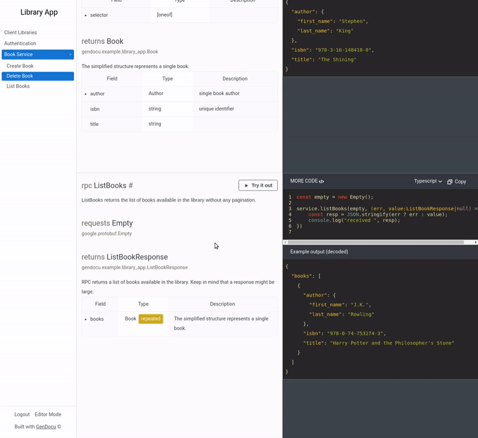

# RPC Invoker

Call your gRPC private service rpc directly from API documentation.




This project is experimental. Use it to enable the try-it-out feature for your private gRPC services.

In the current state, rpc-invoker uses manually provisioned api_spec and grpc file descriptors. 
We are implementing GenDocu's API usage to automate the setup.

## Quick startup

1. Create API on [console.gendocu.com](gendocu.com)
2. Add a proxy field to your `api_spec.yaml`, e.g.
```yaml
spectype: gendocu
servers:
  - selector: "*"
    envs:
    - name: "private" 
      proxy: <proxy-url>
      urls:
      - grpc://<grpc-service-url> # local network address, might be ip or domain
```
3. Download the gRPC API File descriptor from generated SDK repository - it is available at `sdk/grpc-descriptor.pb`
4. Generate SSL certificates for your `rpc-invoker` domain. We strongly recommend using SSL even in VPN-protected networks. Copy the path to the certificate and private key.
5. Run `rpc-invoker` mounting `api_spec.yaml`, `grpc-descriptor.pb`, SSL certificate, and SSL private key inside your private network, e.g. 
```bash
docker run --network host -e PORT=443 \
  --mount type=bind,source=$PWD/api_spec.yaml,target=/app/app_spec.yaml \
  --mount type=bind,source=$PWD/grpc-descriptor.pb,target=/app/app_spec.pb \
  --mount type=bind,source=/etc/letsencrypt/live/test-domain.gendocu.com/cert.pem,target=/app/cert.pem \
  --mount type=bind,source=/etc/letsencrypt/live/test-domain.gendocu.com/privkey.pem,target=/app/privkey.pem \
  gendocu/rpc-invoker
```

More details can be found in [deploying rpc-invoker to your Digital Ocean VPS instance](./docs/DigitalOcean.md).

[API reference](https://doc.gendocu.com/gendocu/api/GendocuPublicApis#.gendocu.rpc_invoker.v1.RpcInvoker)


## Configuration

You can find the code in [pkg/utils/config.go](pkg/utils/config.go).

| Variable Name | Required | Default | Description |
| --- | --- | --- | --- |
| PORT | ❌ | 7050 | HTTP server port. The application supports both grpc-web and grpc protocols. |
| NO_SSL | ❌ | false | When set to true, the application starts an HTTP server without SSL. |
| GRPC_CALL_TIMEOUT_S | ❌ | 10 | Single gRPC call timeout. It also applies to streams. | 
| GRPC_CONNECT_TIMEOUT_S | ❌ | 10 | Timeout for connecting to the gRPC service. | 
| LOGGER_JSON_ENCODING | ❌ | true | | 
| LOGGER_DEBUG_ENABLED | ❌ | true | | 

## License
MIT © gendocu-com
